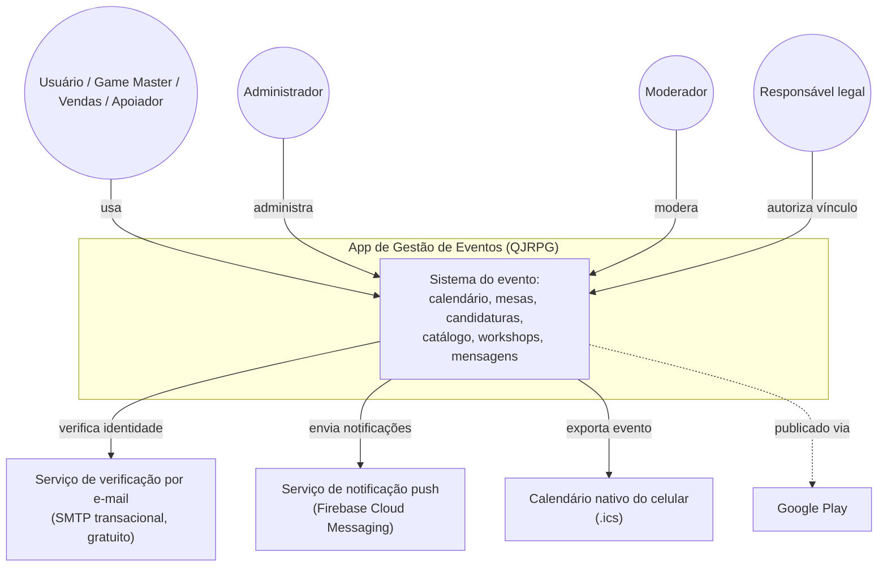
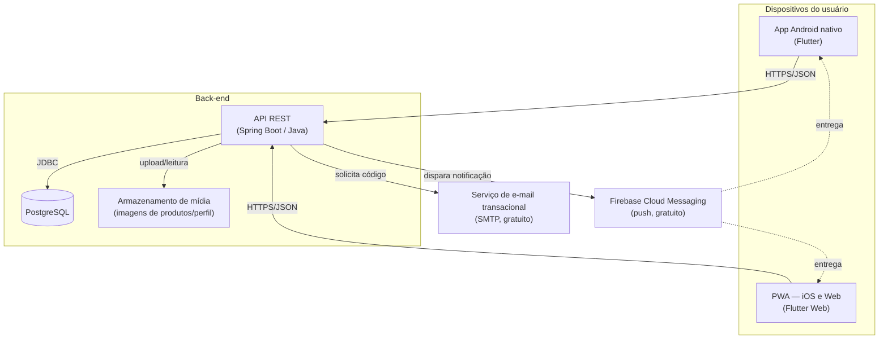
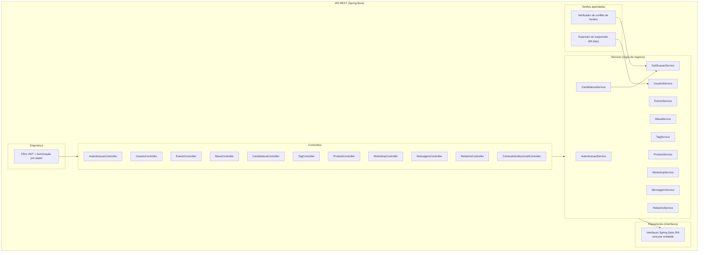
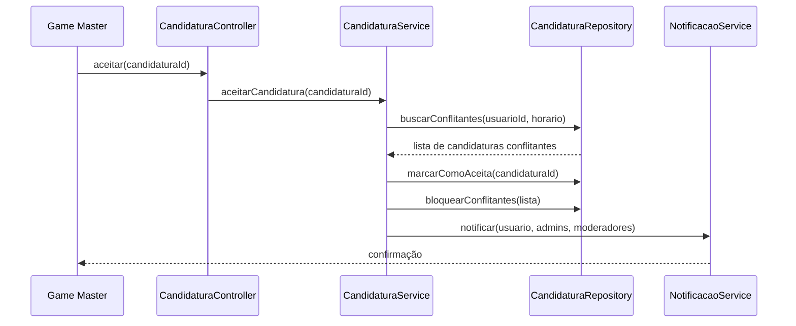

# Arquitetura C4 — App de Gestão de Eventos

Baseado no PRD v0.2 e no Diagrama de Classes. Diagramas em Mermaid `flowchart` (mais
compatível entre GitHub/VS Code do que a sintaxe nativa `C4Context`, que nem todo visualizador
suporta ainda).

## ✅ Decisão tomada: verificação por e-mail

Celular é o identificador da conta; verificação (cadastro, login, 2FA e recuperação) é
feita por **e-mail** (SMTP transacional, gratuito) — evita o custo por mensagem de
provedores de SMS. Diagramas abaixo já refletem essa decisão.

## Nível 1 — Contexto



## Nível 2 — Container



**Hospedagem gratuita candidata (validar disponibilidade atual antes de decidir):**
API Spring Boot → Render/Railway/Fly.io (free tier); PostgreSQL → Neon/Supabase/Railway
(free tier); App Web/PWA → Netlify/Vercel (free tier, estático); Storage → Supabase
Storage/Cloudinary (free tier).

## Nível 3 — Componentes (dentro da API)



Cada `Service` depende apenas da **interface** do `Repository` correspondente (Dependency
Inversion) — isso é o que permite mockar o acesso a dados nos testes automatizados (RNF02),
sem precisar de um banco real em cada teste unitário.

## Nível 4 — Código (exemplo: aceitar candidatura e bloquear conflitos)

Ilustra RF45-RF47 (conflito de horário entre candidaturas do mesmo usuário).



Esqueleto de código correspondente (Java/Spring, ilustrativo):

```java
public interface CandidaturaRepository {
    List<Candidatura> buscarConflitantes(UUID usuarioId, Horario horario);
    void marcarComoAceita(UUID candidaturaId);
    void bloquearConflitantes(List<Candidatura> conflitantes);
}

@Service
public class CandidaturaService {

    private final CandidaturaRepository repository;
    private final NotificacaoService notificacaoService;

    // injeção via construtor -> Dependency Inversion, facilita mock em teste
    public CandidaturaService(CandidaturaRepository repository,
                               NotificacaoService notificacaoService) {
        this.repository = repository;
        this.notificacaoService = notificacaoService;
    }

    public void aceitarCandidatura(UUID candidaturaId, UUID usuarioId, Horario horario) {
        List<Candidatura> conflitantes = repository.buscarConflitantes(usuarioId, horario);
        repository.marcarComoAceita(candidaturaId);
        if (!conflitantes.isEmpty()) {
            repository.bloquearConflitantes(conflitantes);
            notificacaoService.notificarConflito(usuarioId, conflitantes);
        }
    }
}
```

Esse desenho já é testável: um teste unitário injeta um `CandidaturaRepository` e um
`NotificacaoService` falsos (mock) e verifica que `bloquearConflitantes` e
`notificarConflito` são chamados corretamente — sem precisar de banco de dados real.

## Decisão em aberto antes do ambiente de desenvolvimento

1. Confirmar provedores de hospedagem gratuita no momento da implementação (as ofertas de
   free tier mudam com frequência).

## Próximo passo

Seguimos para a configuração do ambiente: JDK, Flutter SDK e estrutura inicial dos dois
projetos (API e app).
