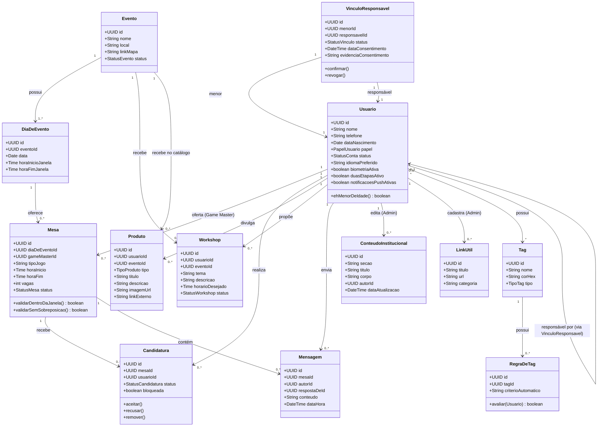

# Diagrama de Classes — App de Gestão de Eventos

Baseado nos requisitos do PRD v0.2. Papel (Admin/Moderador/Comum) é um **atributo** do
Usuário, não uma subclasse — evita hierarquia rígida e facilita promoção/demoção em tempo
de execução (RF22-25), mantendo aderência a SOLID (Open/Closed: novos papéis não exigem
nova classe).

## Notas de design (ligação com SOLID/Clean Code)

- **Single Responsibility:** cada classe representa uma única entidade de domínio; regras
  de validação de horário ficam em métodos da própria `Mesa` (`validarDentroDaJanela`,
  `validarSemSobreposicao`), não espalhadas em controllers.
- **Open/Closed:** `Tag` e `RegraDeTag` são extensíveis (Admin cria tags novas) sem alterar
  código-fonte existente — a lógica de aplicação de regra fica isolada em `RegraDeTag`.
- **Dependency Inversion:** no back-end (Spring Boot), cada uma dessas classes terá uma
  interface de repositório associada (`MesaRepository`, `CandidaturaRepository` etc.), para
  que o `Service` dependa da abstração, não da implementação JPA/PostgreSQL — isso é o que
  torna o CRUD testável (RNF02) com mocks.
- `VinculoResponsavel` é uma classe associativa própria (não um atributo simples em
  `Usuario`), porque carrega estado e regras próprias (RF34-36).

## Próximos passos

1. Revisar se este modelo de classes reflete corretamente o domínio.
2. Avançar para o modelo C4 (Contexto → Container → Componente → Código).
3. Só então configurar o ambiente de desenvolvimento.
