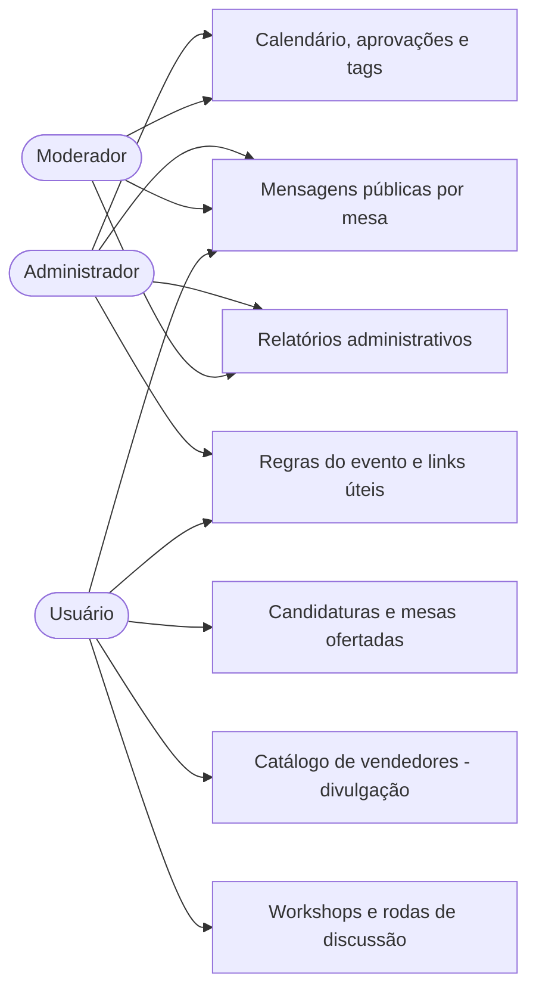

# PRD — App de Gestão de Eventos de RPG, Card Games, Board Games e Wargames

Versão: 0.2 · Autor: Fillipe Albuquerque · Data: 2026-07-24

**Changelog v0.1 → v0.2:** adicionado papel Moderador e hierarquia de permissões;
sistema de tags customizáveis; autenticação por celular com 2FA e biometria;
recuperação de conta; fluxo de menores de idade; internacionalização; acessibilidade;
configurações de privacidade; relatórios administrativos; regras de negócio de
horários de mesas e conflito de candidaturas.

## 1. Visão geral

Aplicativo mobile-first (Android nativo + PWA instalável para iOS/Web) para criação e
gestão de um evento comunitário mensal de jogos de mesa (RPG, card games, board games e
wargames). O público-alvo usa majoritariamente celular como único dispositivo de acesso à
internet — por isso a autenticação e a experiência são desenhadas em torno do número de
celular, não do e-mail. O evento é gratuito, público e comunitário — o app não realiza
cobranças nem processa pagamentos.

## 2. Objetivos do produto

- Centralizar a organização do evento mensal.
- Reduzir atrito para quem quer ofertar ou se candidatar a uma mesa de jogo.
- Dar visibilidade a vendedores e proponentes de workshop dentro do evento.
- Oferecer uma experiência acessível, inclusiva e em múltiplos idiomas.
- Servir como projeto de estudo aplicado de engenharia de software (SOLID, Clean Code, DRY,
  modularização, testes) para o autor.

## 3. Escopo

**Dentro do escopo (v1):**
- Cadastro/autenticação por celular, com 2FA e biometria local.
- Gestão de calendário anual de eventos mensais (com exceções e eventos multi-dia).
- Oferta, aprovação e candidatura a mesas de jogo, com validação de horários e conflitos.
- Mensagens públicas e persistentes por mesa.
- Divulgação (catálogo) de produtos digitais e físicos à venda no evento.
- Proposta e aprovação de workshops/rodas de discussão.
- Notificações push (com opção de desligar).
- Sistema de tags: fixas (Game Master, Vendas, Apoiador, Moderador) e customizáveis pelo
  Administrador.
- Papéis hierárquicos: Administrador e Moderador, com permissões distintas.
- Cadastro de menores de idade vinculado a responsável legal.
- Internacionalização (pt-BR, en-US, es-ES, fr-FR).
- Acessibilidade (WCAG 2.1 AA nos pontos viáveis).
- Configurações de privacidade: desligar notificações, suspender ou excluir conta.
- Relatórios administrativos consolidados de mesas por evento e por período de 12 meses.
- Exportação de evento para o calendário nativo do celular (.ics).

**Fora do escopo (v1):**
- Processamento de pagamento ou qualquer transação financeira dentro do app.
- E-commerce (carrinho, estoque, checkout).
- Publicação nativa na Apple App Store (uso de PWA no lugar).
- Monetização por anúncios ou cobrança pelo uso do app.
- Verificação documental de identidade do responsável legal de um menor (v1 usa vínculo por
  número de celular + revisão humana; verificação documental fica como evolução futura).
- Lista de espera formal em mesas lotadas.

## 4. Personas e papéis

| Papel | Descrição |
|---|---|
| Administrador | Controle total: calendário, aprovações, tags, promoção/demoção de Admin e Moderador, relatórios. |
| Moderador | Perfil operacional similar ao Administrador (aprovações, moderação de conteúdo, tags de usuários comuns), mas **não pode alterar o acesso de um Administrador** nem promover/demover Moderadores — isso é exclusivo do Administrador. |
| Usuário (base) | Visualiza eventos, mesas e catálogo; pode se candidatar, ofertar mesas, divulgar produtos e propor workshops. |
| Menor de idade | Usuário com conta vinculada a um responsável legal até completar 18 anos ou até o vínculo ser desfeito. |
| Tag: Game Master | Atribuída automaticamente a quem tem uma mesa aprovada. |
| Tag: Vendas | Atribuída automaticamente a quem cadastra um produto no catálogo. |
| Tag: Apoiador | Atribuída automaticamente a quem tem um workshop aprovado. |
| Tag: Moderador | Atribuída somente por promoção feita por um Administrador. |
| Tags customizadas | Criadas por um Administrador conforme necessidade (nome, cor exclusiva, regra de aplicação). |

Tags são cumulativas — um usuário pode ter várias ao mesmo tempo.

### 4.1 Matriz de permissões (hierarquia de acesso)

| Ação | Administrador | Moderador |
|---|---|---|
| Promover/demover Administrador | Sim | Não |
| Promover usuário a Moderador | Sim | Não |
| Demover Moderador | Sim | Não |
| Adicionar/remover tags de usuários comuns | Sim | Sim |
| Alterar tags de um Administrador | Sim | Não |
| Criar tags customizadas e regras | Sim | Não |
| Aprovar/recusar mesas e workshops | Sim | Sim |
| Responder mensagens públicas | Sim | Sim |
| Suspender/excluir conta de usuário comum | Sim | Sim |
| Suspender/excluir conta de Moderador ou Admin | Sim | Não |
| Acessar relatórios administrativos | Sim | Sim |
| Editar as regras gerais do evento | Sim | Não |

Matriz totalmente confirmada pelo autor.

## 5. Sistema de tags

- Tags fixas do sistema: Game Master, Vendas, Apoiador, Moderador — aplicadas
  automaticamente pelas regras já descritas (RF09, RF15, RF19) ou por promoção (Moderador).
- Tags customizadas: um Administrador pode criar uma tag nova definindo nome, cor exclusiva
  e a regra de quando ela é aplicada (manual, ou vinculada a algum evento do sistema, ex.
  "participou de 6 edições seguidas").
- Cada tag tem uma cor exclusiva no sistema — não é permitido criar duas tags com a mesma
  cor, para manter a leitura visual inequívoca.
- Por acessibilidade, cor nunca é o único indicador: toda tag também exibe seu nome em
  texto (ver seção 8).

## 6. Autenticação e segurança

### 6.1 Cadastro e login
Celular é o **identificador** da conta (é o que aparece no perfil e é usado por
responsáveis/contatos de confiança). A **verificação** — cadastro, login e recuperação —
é feita por **código enviado por e-mail**, que é 100% gratuito (SMS tem custo por
mensagem na maioria dos provedores, o que conflita com o objetivo de custo zero). Por
isso, o e-mail passa a ser obrigatório no cadastro, mesmo sendo um app "mobile-first por
celular".

### 6.2 Autenticação de dois fatores (2FA) — opcional, configurável
- Código por e-mail (canal já usado no login primário).
- Aplicativo autenticador de terceiros, usando o padrão aberto **TOTP (RFC 6238)** —
  compatível com Google Authenticator, Microsoft Authenticator, Authy etc.
- SMS como segundo fator fica **fora da v1** por ter custo por mensagem; pode ser
  adicionado depois se o orçamento do projeto permitir.

### 6.3 Biometria local
Após o primeiro login, se o dispositivo suportar, o app **sugere uma única vez** o uso de
biometria (digital/Face) para acessos futuros. A biometria é validada e armazenada
**apenas localmente** no dispositivo (Android Keystore / iOS Keychain) — nunca trafega
nem é armazenada no servidor. Pode ser ativada ou desativada a qualquer momento em
Configurações.

### 6.4 Recuperação de conta — alternativas modernas

Sua ideia de e-mail de recuperação é válida, mas isolada ela é fraca (e-mail muitas vezes
não é checado por esse público). Recomendo combinar:

| Mecanismo | Como funciona | Por que ajuda |
|---|---|---|
| Contato de confiança (sua ideia) | Um segundo número de celular, de alguém próximo, aprova a recuperação | Não depende de e-mail; funciona bem no perfil "só celular" |
| Códigos de backup | 8-10 códigos de uso único gerados no cadastro, para o usuário guardar offline | Funciona mesmo sem acesso a SMS/e-mail; padrão usado por Google/GitHub |
| Passkeys / WebAuthn | Chave criptográfica vinculada ao dispositivo, sem senha | Resistente a phishing; suportado nativamente por Android e iOS recentes — bom candidato para v2 |
| Período de espera de segurança | Recuperação sensível (troca de número, por exemplo) só é concluída após X horas, com aviso ao dispositivo antigo | Dá chance de a vítima de um ataque cancelar a recuperação fraudulenta |
| Combinação de 2 de 3 fatores | Exigir 2 entre (e-mail antigo, contato de confiança, códigos de backup) para liberar recuperação total | Eleva o custo de um ataque sem exigir verificação documental |

Recomendação para v1: **contato de confiança + códigos de backup + período de espera**.
Passkeys ficam como evolução natural para v2, quando a base de usuários já estiver
validada.

### 6.5 Contas de menores de idade — modelo em camadas

Sim, nome + telefone do responsável é válido e é uma melhoria real sobre só o telefone: dá
um registro legível por humano (útil se a organização precisar contatar alguém na dúvida) e
já é o padrão mínimo esperado pela LGPD. Mas "válido" não é o mesmo que "forte" — por isso
recomendo pensar nisso como **camadas**, não como uma escolha única. Você escolhe até onde
subir dependendo do risco que aceita correr:

| Camada | O que exige | Nível de segurança | Esforço de implementação |
|---|---|---|---|
| 1 — Vínculo básico | Nome, telefone e e-mail do responsável; confirmação por link/código enviado ao e-mail informado | Baixo — só prova posse do e-mail, não identidade | Baixo (o que já estava no PRD) |
| 2 — Consentimento eletrônico com evidência *(recomendado para v1)* | Camada 1 + o responsável precisa ler um termo específico e clicar em "autorizo", com data/hora e IP/dispositivo registrados | Médio — não verifica identidade, mas cria prova documental do consentimento, que é o que a LGPD realmente exige guardar (Art. 14) | Baixo/médio — é só uma tela de aceite a mais, sem custo |
| 3 — Verificação documental *(opcional, v2)* | Camada 2 + foto de um documento de identidade do responsável, revisada manualmente por um Admin/Moderador (sem API paga de verificação) | Alto — confirma que existe um documento real por trás do vínculo | Alto — exige fila de revisão manual (trabalho voluntário), armazenamento criptografado do documento, política de retenção/exclusão e controle de acesso restrito só a quem revisa |

**Recomendação:** Camada 1 + 2 para a v1 (sem custo, sem trabalho manual extra, e já
resolve a exigência de "consentimento específico e em destaque" da LGPD). Camada 3 fica
como um "selo verificado" opcional, oferecido a quem quiser mais garantia, e só quando o
projeto tiver braço voluntário disponível para revisar documentos manualmente — subir essa
camada aumenta bastante a responsabilidade de proteção de dados (documento de identidade é
dado sensível, precisa de criptografia em repouso e prazo de retenção definido).

Outros recursos que valem considerar, sem custo adicional:
- **Revogação imediata pelo próprio responsável** — diferente do desvínculo para *outro*
  responsável (que passa por revisão de Admin/Moderador para evitar sequestro de vínculo),
  o responsável atual pode suspender o acesso do menor instantaneamente, a qualquer
  momento, sem precisar de aprovação — é uma ação protetiva, não arriscada.
- **Painel do responsável** — o responsável pode ver as participações do menor no evento
  (mesas, candidaturas) enquanto o vínculo estiver ativo, sem precisar pedir nada à
  organização.
- **Exposição pública reduzida** — não exibir a idade exata do menor em nenhum lugar
  público (faixa etária, se necessário) e evitar exibir o contato direto do menor a outros
  usuários.

Tudo isso está alinhado ao **Art. 14 da LGPD**, que exige consentimento específico e em
destaque de um dos pais ou responsável legal para tratar dados de crianças e adolescentes,
e recomenda manter evidência desse consentimento.

## 7. Internacionalização

Idiomas suportados desde a v1: **português (Brasil)** como padrão, **inglês (EUA)**,
**espanhol (Espanha)** e **francês (França)**. Todo texto de interface deve vir de
arquivos de recurso (nunca hardcoded), tanto no app (Flutter `intl`/ARB) quanto nas
mensagens de erro da API.

## 8. Acessibilidade

Meta: WCAG 2.1 nível AA nos pontos que não aumentam complexidade de desenvolvimento —
a maioria vem "de graça" ao usar corretamente os recursos nativos do framework:

- Fonte escalável pelo tamanho definido no sistema operacional (nunca tamanhos fixos em
  pixel que ignoram a configuração do usuário) — cobre zoom para baixa visão.
- Suporte a leitor de tela (TalkBack/VoiceOver) via widgets semânticos nativos do Flutter.
- Tema de alto contraste — viável a baixo custo se as cores forem centralizadas em
  variáveis de tema desde o início (nunca cor "hardcoded" espalhada pelo código).
- Nenhuma informação de estado (aprovado/pendente/recusado, tags) depende só de cor —
  sempre acompanhada de texto ou ícone.

## 9. Regras do evento (conteúdo institucional)

Inspirado no modelo real que você compartilhou (Quero Jogar RPG): o evento precisa de um
espaço de regras e informações gerais, sempre visível, com edição restrita.

- Conteúdo é estruturado como um pequeno CMS: seções nomeadas (ex.: "Regras gerais",
  "Como se inscrever — Mestre", "Como se inscrever — Jogador", "Frequência e local") com
  título e corpo em texto formatado.
- Visível a qualquer usuário, autenticado ou não, a qualquer momento.
- Editável apenas por Administrador — Moderador pode visualizar, não editar (ver matriz de
  permissões, seção 4.1).
- Cada edição registra quem editou e quando (auditoria simples, RNF09).
- Comporta informações como as do seu exemplo: frequência do evento, horário padrão,
  local com link de mapa, papéis de mestre/jogador, e referência ao Estatuto da Criança e
  Adolescente quanto a registro de imagem de terceiros no evento.

## 10. Links úteis e conteúdo educativo

- Administrador mantém uma lista de links externos categorizados (ex.: "Rede social",
  "Grupo de comunidade", "Loja", "Vídeo explicativo"), com título, URL e categoria.
- Usado tanto para links institucionais (Instagram, grupo de comunidade, loja) quanto para
  conteúdo educativo sobre os tipos de jogo (ex.: vídeos explicando o que é RPG, boardgame,
  cardgame e wargame para quem é curioso e nunca jogou).
- Exibido a qualquer usuário, organizado por categoria.
- Editável apenas por Administrador.

## 11. Requisitos funcionais

| ID | Módulo | Descrição | Critério de aceite |
|---|---|---|---|
| RF01 | Autenticação | Usuário cria conta com celular (identificador) e e-mail (verificação). | Dado um cadastro válido, quando o código de e-mail é confirmado, a conta é criada e permite login. |
| RF02 | Autenticação | Sistema distingue papéis Administrador, Moderador e Usuário comum. | Ações restritas retornam erro de permissão para quem não tem o papel exigido. |
| RF03 | Perfil | Usuário pode editar nome, foto e contato do próprio perfil. | Alterações salvas são refletidas imediatamente. |
| RF04 | Calendário | Admin cria, edita e exclui datas de eventos mensais do ano vigente, incluindo exceções. | Data criada/editada/excluída aparece corretamente no calendário público. |
| RF05 | Calendário | Usuário visualiza o calendário anual com data, horário e local de cada evento. | Lista de eventos do ano exibida ordenada por data. |
| RF06 | Mesas | Admin define e edita os intervalos de horário e quantidade de mesas disponíveis por evento/dia. | Configuração salva limita as ofertas possíveis para aquele evento. |
| RF07 | Mesas | Usuário oferta uma mesa dentro dos horários/mesas disponíveis. | Oferta criada com status "pendente", vinculada a evento e horário válidos. |
| RF08 | Mesas | Admin ou Moderador aprova, recusa ou solicita ajuste em uma mesa ofertada. | Status muda e é refletido ao ofertante. |
| RF09 | Mesas | Ao ter uma mesa aprovada, o usuário recebe a tag Game Master. | Tag aparece automaticamente no perfil. |
| RF10 | Candidaturas | Usuário se candidata a uma mesa aprovada. | Candidatura registrada, respeitando limite de vagas. |
| RF11 | Candidaturas | Game Master aprova ou recusa candidaturas recebidas em sua mesa. | Status muda e o candidato é informado. |
| RF12 | Mensagens | Usuário envia mensagem pública vinculada a uma mesa. | Mensagem visível de forma persistente na página da mesa. |
| RF13 | Mensagens | Admin ou Moderador responde publicamente mensagens de uma mesa. | Resposta aparece encadeada, de forma persistente. |
| RF14 | Catálogo | Usuário cadastra divulgação de produto (digital ou físico). | Produto aparece no catálogo do evento correspondente. |
| RF15 | Catálogo | Ao cadastrar um produto, o usuário recebe a tag Vendas. | Tag aparece automaticamente. |
| RF16 | Catálogo | Usuário visualiza o catálogo de produtos divulgados para um evento. | Lista exibida com filtro por tipo (digital/físico). |
| RF17 | Workshops | Usuário propõe workshop/roda de discussão. | Proposta criada com status "pendente". |
| RF18 | Workshops | Admin ou Moderador aprova ou recusa proposta de workshop. | Status muda e o proponente é informado. |
| RF19 | Workshops | Ao ter um workshop aprovado, o usuário recebe a tag Apoiador. | Tag aparece automaticamente. |
| RF20 | Notificações | Sistema envia push para: aprovação/recusa de mesa, candidatura, workshop e resposta em mensagem acompanhada. | Notificação chega em poucos segundos após o evento gerador. |
| RF21 | Perfil | Usuário acumula múltiplas tags simultaneamente. | Perfil exibe todas as tags aplicáveis ao mesmo tempo. |
| RF22 | Papéis | Administrador promove ou demove outro usuário para/de Administrador. | Mudança de papel reflete imediatamente nas permissões do usuário. |
| RF23 | Papéis | Apenas um Administrador promove um usuário a Moderador. | Tentativa de um Moderador promover outro usuário é bloqueada. |
| RF24 | Papéis | Apenas um Administrador demove um Moderador. | Tentativa de um Moderador demover outro é bloqueada. |
| RF25 | Papéis | Moderador não altera o acesso de um Administrador (tags, promoção, demoção). | Ação de Moderador sobre um Admin retorna erro de permissão. |
| RF26 | Tags | Admin adiciona ou remove tags de usuários comuns. | Alteração reflete no perfil do usuário-alvo. |
| RF27 | Tags | Admin cria tags customizadas com nome, cor exclusiva e regra de aplicação. | Nova tag fica disponível para uso no sistema. |
| RF28 | Tags | Cada tag tem cor exclusiva; duas tags não compartilham cor. | Tentativa de criar tag com cor já usada é bloqueada. |
| RF29 | Autenticação | Login exige código de verificação enviado por e-mail; celular é o identificador da conta. | Login só é concluído após código correto. |
| RF30 | Autenticação | Usuário habilita 2FA por e-mail ou app autenticador (TOTP); SMS fica fora da v1. | Login exige o segundo fator quando habilitado. |
| RF31 | Autenticação | App sugere biometria uma única vez após o primeiro login, se suportado. | Sugestão aparece só uma vez; não é repetida automaticamente. |
| RF32 | Autenticação | Usuário ativa/desativa biometria a qualquer momento em Configurações. | Alteração some/aparece a exigência de biometria no próximo login. |
| RF33 | Autenticação | Recuperação de conta usa contato de confiança, códigos de backup e período de espera de segurança. | Recuperação só se completa após validação combinada e o prazo de espera. |
| RF34 | Menores de idade | Cadastro de menor de 18 anos exige nome, celular e e-mail de responsável legal. | Cadastro sem esses dados não é concluído. |
| RF35 | Menores de idade | Conta de menor fica "pendente de autorização" até o responsável confirmar o vínculo por link/código enviado por e-mail. | Conta pendente não acessa funcionalidades além da confirmação. |
| RF35b | Menores de idade | Confirmação do vínculo exige que o responsável leia um termo específico e aceite explicitamente, com data/hora e dispositivo registrados. | Aceite fica salvo como evidência de consentimento, consultável em auditoria. |
| RF36 | Menores de idade | Vínculo para um *novo* responsável exige solicitação avaliada por Admin/Moderador. | Troca de responsável automática (self-service) não é permitida. |
| RF36b | Menores de idade | O responsável atual pode revogar/suspender o próprio vínculo imediatamente, sem aprovação. | Revogação surte efeito assim que confirmada pelo responsável. |
| RF36c | Menores de idade | Responsável visualiza as participações do menor (mesas, candidaturas) enquanto o vínculo estiver ativo. | Painel do responsável reflete os dados reais do menor vinculado. |
| RF37 | Configurações | Usuário desliga notificações push a qualquer momento. | Nenhuma push é enviada após desligar. |
| RF38 | Configurações | Usuário suspende a própria conta por até 90 dias, reversível. | Conta reaparece ativa ao reverter dentro do prazo; expira após 90 dias sem reversão. |
| RF39 | Configurações | Usuário solicita exclusão completa dos próprios dados. | Dados pessoais são removidos/anonimizados conforme LGPD. |
| RF40 | Configurações | Usuário configura se ações destrutivas pedem confirmação dupla. | Preferência é respeitada nas próximas ações do tipo. |
| RF41 | Relatórios | Admin/Moderador consulta mesas ofertadas por evento e consolidado de 12 meses. | Relatório reflete dados reais do período consultado. |
| RF42 | Relatórios | Consulta permite filtrar por Game Master, tipo de jogo, vagas, mês, ano, frequência de participação, faixa etária e sexo (M/F). | Cada filtro aplicado altera corretamente o resultado exibido. |
| RF43 | Calendário do dispositivo | Usuário adiciona um evento de interesse ao calendário nativo do celular. | Arquivo .ics gerado é aceito pelos principais apps de calendário. |
| RF44 | Candidaturas | Usuário se candidata a várias mesas, mesmo com horários conflitantes. | Sistema permite múltiplas candidaturas simultâneas pendentes. |
| RF45 | Candidaturas | Conflito de horário entre candidaturas do mesmo usuário notifica o usuário, Admins e Moderadores. | Notificação é enviada às três partes assim que o conflito surge. |
| RF46 | Candidaturas | Ao aceitar uma candidatura, as conflitantes do mesmo usuário ficam bloqueadas (tachadas). | Candidatura conflitante não pode mais ser aceita enquanto bloqueada. |
| RF47 | Candidaturas | Candidatura bloqueada pode ser removida pelo usuário, pelo Game Master, por Moderador ou Admin. | Remoção libera a candidatura para nova decisão, se aplicável. |
| RF48 | Mesas | Usuário não oferta mais de uma mesa no mesmo horário do mesmo evento. | Tentativa de oferta sobreposta é bloqueada com mensagem clara. |
| RF49 | Mesas | Mesa não pode ser ofertada fora da janela de horário do evento/dia. | Tentativa fora da janela é bloqueada. |
| RF50 | Calendário | Evento pode ter mais de um dia, cada um com janela de horário própria. | Cada dia do evento aceita configuração independente. |
| RF51 | Moderação | Ao suspender/excluir um usuário, sistema pergunta se deve excluir também seu conteúdo associado. | Pergunta aparece antes da confirmação final da ação. |
| RF52 | Regras do evento | Qualquer usuário, autenticado ou não, consulta as regras gerais do evento a qualquer momento. | Conteúdo é acessível sem exigir login. |
| RF53 | Regras do evento | Apenas Administrador cria ou edita o conteúdo das regras do evento. | Tentativa de edição por Moderador ou usuário comum é bloqueada. |
| RF54 | Regras do evento | Cada edição do conteúdo registra autor e data/hora. | Histórico de edição é consultável em auditoria. |
| RF55 | Links úteis | Administrador cadastra links externos com título, URL e categoria. | Link cadastrado aparece na listagem pública organizada por categoria. |
| RF56 | Links úteis | Qualquer usuário visualiza a lista de links úteis e conteúdo educativo sobre os jogos. | Lista é acessível sem exigir login. |

## 12. Requisitos não funcionais

| ID | Categoria | Descrição | Critério de aceite |
|---|---|---|---|
| RNF01 | Manutenibilidade | Código segue SOLID, DRY, Clean Code, nomenclatura semântica e módulos desacoplados. | Revisão de código não identifica violação evidente nas camadas. |
| RNF02 | Testabilidade | Toda operação de CRUD tem cobertura de testes automatizados. | Pipeline de testes valida cada CRUD sem intervenção manual. |
| RNF03 | Portabilidade | App funciona em Android nativo e iOS/Web via PWA, base de código única. | Mesma funcionalidade validada nas duas plataformas. |
| RNF04 | Custo | Infraestrutura opera em camadas gratuitas, exceto taxa única da Google Play. | Nenhuma cobrança recorrente é gerada. |
| RNF05 | Disponibilidade | Sistema disponível especialmente nos dias próximos e durante o evento mensal. | Uptime aceitável concentrado na janela de pico. |
| RNF06 | Segurança e privacidade | Dados pessoais tratados conforme a LGPD, com consentimento explícito no cadastro. | Cadastro exige aceite explícito; dados sensíveis não trafegam em texto puro. |
| RNF07 | Usabilidade | Interface mobile-first, fluxos centrais em poucos toques. | Fluxo principal completado em poucos passos. |
| RNF08 | Persistência de mensagens | Mensagens públicas por mesa não expiram automaticamente. | Mensagem antiga continua acessível meses depois. |
| RNF09 | Observabilidade | Operações críticas são registradas em log. | Log permite reconstruir quem fez o quê e quando. |
| RNF10 | Escalabilidade modesta | Arquitetura suporta picos concentrados de uso sem infraestrutura paga. | Resposta aceitável no free tier durante pico mensal simulado. |
| RNF11 | Internacionalização | Interface suporta pt-BR, en-US, es-ES e fr-FR desde a v1. | Nenhuma string de interface é fixa no código-fonte. |
| RNF12 | Acessibilidade | Interface atende WCAG 2.1 AA nos pontos viáveis sem aumento relevante de complexidade. | Fonte escalável, alto contraste e leitor de tela funcionam nas telas principais. |
| RNF13 | Segurança | Biometria é validada e armazenada apenas localmente (Keystore/Keychain). | Nenhum dado biométrico trafega ou é persistido no servidor. |
| RNF14 | Segurança | 2FA via app autenticador segue padrão aberto TOTP (RFC 6238). | Compatível com Google Authenticator, Microsoft Authenticator, Authy. |
| RNF15 | Privacidade | Dados de menores recebem tratamento especial conforme Art. 14 da LGPD. | Consentimento do responsável é obrigatório e registrado. |
| RNF16 | Privacidade | Relatórios exibem idade em faixas etárias agregadas, nunca data de nascimento exata. | Nenhum relatório expõe data de nascimento individual. |
| RNF17 | Recuperação de conta | Recuperação usa ao menos dois fatores independentes e período de espera de segurança. | Recuperação de conta sensível não se completa instantaneamente. |
| RNF18 | Privacidade | Consentimento do responsável legal de um menor é registrado com evidência (data/hora, dispositivo). | Evidência de consentimento é consultável em caso de auditoria. |

## 13. Regras de negócio — mesas e candidaturas

- Uma mesa tem horário de início e fim; mesas do mesmo evento podem ter horário de início
  igual ao de término da anterior (ex.: mesa 1 das 9h-14h, mesa 2 das 14h-18h, mesa 3 das
  18h-22h) — não é considerado conflito.
- Um usuário não pode ofertar duas mesas no mesmo horário dentro do mesmo evento.
- Nenhuma mesa pode ser ofertada fora da janela de horário definida pelo Administrador
  para aquele evento/dia (ex.: evento das 9h às 22h não aceita mesa às 8h ou que termine
  às 23h).
- Eventos podem ter mais de um dia, cada um com janela de horário própria e independente.
- Um usuário pode se candidatar a várias mesas, mesmo com horários conflitantes entre si.
- Ao surgir conflito de horário entre candidaturas do mesmo usuário: usuário, Admins e
  Moderadores são notificados.
- Quando uma dessas candidaturas é aceita por um Game Master, as demais candidaturas
  conflitantes do mesmo usuário ficam bloqueadas/tachadas — não podem mais ser aceitas
  enquanto o bloqueio existir.
- O bloqueio é removido quando a candidatura é excluída pelo próprio usuário, pelo Game
  Master da mesa em questão, por um Moderador ou por um Administrador.

## 14. Histórias de usuário (adicionadas nesta revisão)

**US11 (Administrador) — Promover Moderador — RF23, RF24**
Como administrador, quero promover um usuário a Moderador e, se necessário, demovê-lo,
para distribuir a carga de moderação do evento sem abrir mão do controle final.
*Aceite:* somente contas com papel Administrador conseguem executar essas ações.

**US12 (Moderador) — Moderar sem acesso a Admin — RF25**
Como moderador, quero poder aprovar mesas e responder mensagens, mas não quero (nem devo)
conseguir alterar o acesso de um Administrador, para que a hierarquia de segurança seja
respeitada mesmo por engano.
*Aceite:* qualquer tentativa de um Moderador alterar tags/acesso de um Admin é bloqueada
com mensagem clara.

**US13 (Usuário responsável por menor) — Autorizar vínculo — RF34, RF35**
Como responsável legal, quero autorizar o cadastro do meu filho/filha no app, para que ele
participe do evento com minha supervisão.
*Aceite:* a conta do menor só sai do estado "pendente" após minha confirmação explícita.

**US14 (Usuário) — Recuperar conta perdida — RF33**
Como usuário que perdeu acesso ao celular, quero recuperar minha conta usando meu contato
de confiança e códigos de backup, para não perder meu histórico no app.
*Aceite:* recuperação exige ao menos dois fatores e um período de espera antes de
concluir.

**US15 (Usuário) — Adicionar mesa ao calendário do celular — RF43**
Como usuário, quero adicionar um evento de interesse ao calendário nativo do meu celular,
para não esquecer a data.
*Aceite:* o app gera um arquivo .ics aceito pelo Google Calendar e pelo Calendar da Apple.

**US16 (Administrador) — Consultar relatório consolidado — RF41, RF42**
Como administrador, quero consultar quantas mesas foram ofertadas por evento e no total dos
últimos 12 meses, filtrando por Game Master, tipo de jogo, vagas, período, frequência,
faixa etária e sexo, para entender o crescimento e o perfil do evento.
*Aceite:* cada combinação de filtro retorna dados consistentes com o período selecionado.

**US17 (Usuário) — Consultar regras do evento — RF52**
Como usuário curioso, quero consultar as regras gerais do evento a qualquer momento, mesmo
sem estar logado, para saber o que esperar antes de decidir participar.
*Aceite:* a página de regras abre sem exigir autenticação.

**US18 (Usuário) — Aprender sobre os tipos de jogo — RF56**
Como usuário novo no hobby, quero encontrar vídeos e links explicando o que são RPG,
boardgame, cardgame e wargame, para entender o que cada mesa oferece antes de me
candidatar.
*Aceite:* a lista de links exibe os conteúdos organizados por categoria.

## 15. Diagrama de caso de uso (visão macro)

## 16. Premissas assumidas (a validar)

- ~~Moderador pode adicionar/remover tags de usuários comuns e acessar relatórios, mas não
  pode criar tags customizadas~~ — **confirmado pelo autor**.
- ~~"Frequência de participação" nos relatórios é calculada por número de eventos em que o
  usuário teve mesa ofertada e/ou candidatura aceita~~ — **confirmado pelo autor**.
- ~~Vínculo de menor de idade usa consentimento eletrônico com evidência (Camada 1+2)~~ —
  **confirmado**: Camada 3 (verificação documental) não entra na v1.
- ~~Moderador pode suspender/excluir conta de usuário comum~~ — **confirmado como Sim**.
- Sexo é um campo autodeclarado e opcional, usado apenas para fins estatísticos nos
  relatórios administrativos.
- Um evento tem um único local físico por edição (sem múltiplos endereços simultâneos).
- As "Regras do evento" (seção 9) são um conteúdo único e estruturado em seções, não um
  documento por evento — a mesma regra vale para todas as edições, salvo você queira regras
  específicas por evento.

