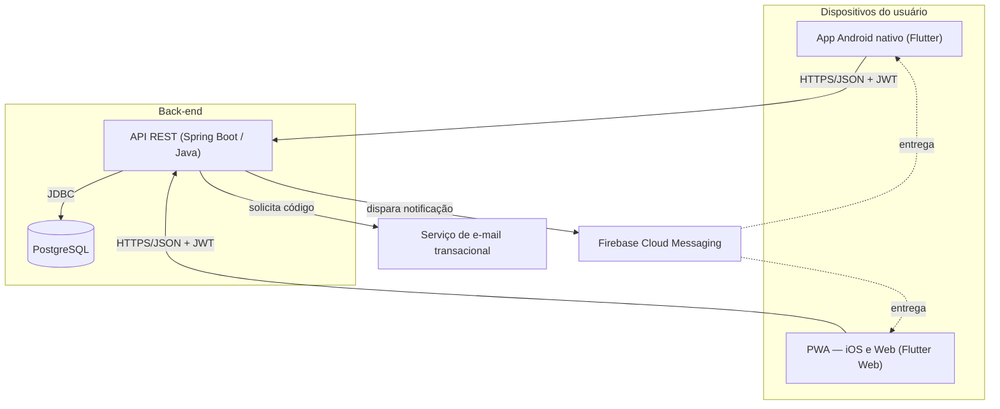
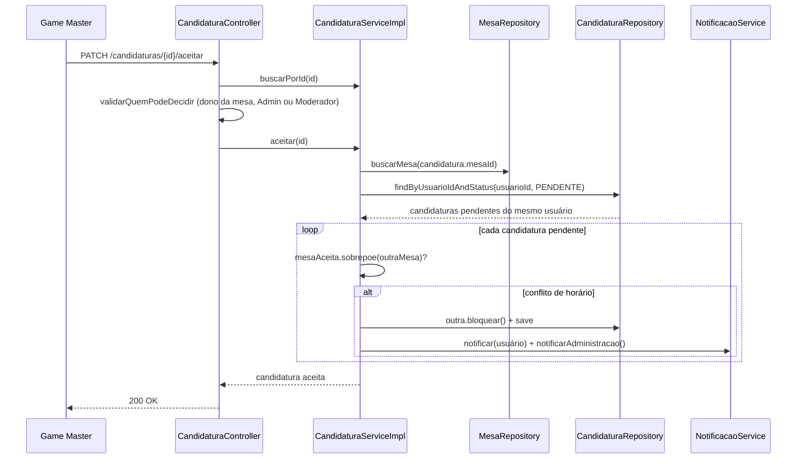

# QJRPG App — Discovery de Documentação (Diagrams as Code)

Este documento registra uma fase de discovery sobre o sistema **QJRPG** (app de gestão de
eventos comunitários de RPG, boardgame, cardgame e wargame). Os diagramas ficam versionados
como código Mermaid, junto do PRD e da arquitetura C4 já presentes neste repositório
(`PRD_App_Eventos_RPG.md`, `C4_Arquitetura.md`).

## 1. Descrição do sistema

**Escopo.** App mobile-first (Android nativo + PWA) para um evento presencial mensal,
gratuito e comunitário. Cobre calendário de eventos, oferta e candidatura a mesas de jogo,
catálogo de vendedores, workshops, mensagens públicas por mesa, moderação e relatórios.

**Nível de visão.** Este documento opera no nível de **Container** (C4, Nível 2): mostra
as unidades executáveis e como se comunicam, sem entrar em classes ou métodos. A visão de
componentes e o diagrama de classes ficam nos documentos já publicados no repositório.

**Limites e responsabilidades.** O app organiza o evento; não processa pagamento, não
substitui redes sociais e não verifica identidade documental. Administrador controla o
calendário e papéis; Moderador aprova conteúdo sem alterar acesso de Admin; qualquer
usuário autenticado oferta mesa, candidata-se e vende.

**Integrações.** Banco PostgreSQL, e-mail transacional (verificação de conta), Firebase
Cloud Messaging (notificação push), calendário nativo do dispositivo via arquivo `.ics`.

**Restrições.** Orçamento zero de infraestrutura (camadas gratuitas), Java 21 + Spring
Boot no back-end, Flutter no front-end, sem dependência de loja paga (App Store).

**Lacunas conhecidas.** Sem contrato de API formal (OpenAPI), sem diagrama entidade-
relacionamento do banco, sem ADRs individuais por decisão, notificação push ainda sem
projeto Firebase real conectado.

## 2. Diagrama estrutural — Containers

**Estado alvo x estado implementado hoje:**

| Container | Doc original (C4) | Código real hoje |
|---|---|---|
| Verificação | SMTP transacional | Código de verificação devolvido na própria resposta da API (modo desenvolvimento, sem envio real) |
| Push | Firebase Cloud Messaging | Serviço interno grava em log; a integração com FCM não foi conectada |

## 3. Diagrama comportamental — Aceitar candidatura (jornada crítica)

O diagrama de sequência original do C4 (Nível 4) descrevia o fluxo em alto nível. Ajustei
para bater com o código que existe hoje: adicionei a checagem de dono do recurso (só o
Game Master da mesa, Admin ou Moderador decide) e troquei os métodos genéricos de
repositório pelo comportamento real (`Mesa.sobrepoe()` decide o conflito, o laço fica no
Service, não no Repository).

## 4. O que a IA acertou, o que precisei ajustar, o que falta

**Acertou:** a estrutura em camadas (Controller → Service → Repository) com injeção por
interface, coerente com Dependency Inversion; a escolha de stack dado o contexto real
(Flutter para multiplataforma, Spring Boot aproveitando experiência prévia em Java); a
regra de conflito de horário ficou correta desde a primeira versão testada.

**Precisei ajustar:** os primeiros esquemas de dados eram genéricos demais — só depois de
eu compartilhar exemplos reais de postagem de mesa (sistema do jogo, sinopse, vagas
reservadas) o modelo ajustou os campos. A decisão de autenticação por SMS mudou pra e-mail
depois de eu apontar o custo por mensagem, algo que o C4 original não tinha calculado. O
diagrama de sequência original omitia controle de autorização por dono do recurso — isso só
apareceu numa rodada de hardening posterior, não no design inicial.

**Falta para um agente construir sem inventar decisões:**
- Diagrama entidade-relacionamento do banco (hoje só existe como código JPA).
- Contrato de API versionado (OpenAPI/Swagger), não só os controllers como fonte da verdade.
- ADRs individuais por decisão (motivo, alternativas descartadas, consequência) — hoje as
  decisões estão espalhadas em atas de rodadas de desenvolvimento, não centralizadas.
- Critérios de aceite testáveis por requisito não funcional (ex.: latência aceitável,
  taxa de disponibilidade), hoje descritos qualitativamente no PRD.
- Confirmação explícita de qual char provedor de hospedagem gratuita foi de fato escolhido
  (o C4 lista candidatos, não a decisão final).

## Referências

- `PRD_App_Eventos_RPG.md` — requisitos funcionais e não funcionais (alinhado à ISO/IEC/IEEE 29148)
- `C4_Arquitetura.md` — Níveis 1 a 4 do modelo C4
- Mapeamento 4+1: visão lógica → diagrama de classes; visão de processo → diagrama de
  sequência (seção 3); visão física → diagrama de containers (seção 2); visão de
  desenvolvimento → estrutura de pacotes do código-fonte; cenários → histórias de usuário do PRD
